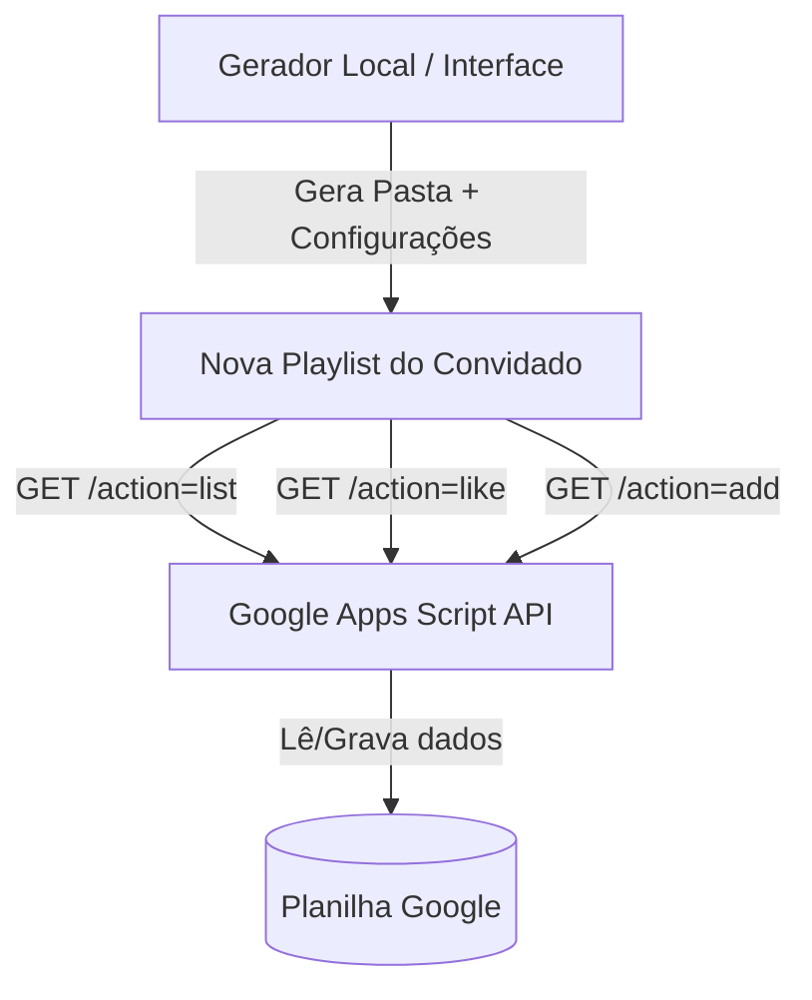

# Documentação do Projeto: Motor de Playlist de Convidados

Este documento centraliza as especificações técnicas, arquitetura de arquivos, funcionamento detalhado e dependências do Motor de Playlist de Convidados.

---

## 1. Arquitetura do Sistema

O sistema é composto por três componentes principais:
1. **Google Apps Script + Planilha Google**: Atua como banco de dados em nuvem. Armazena as músicas sugeridas, seus identificadores únicos (UUIDs) e a contagem de curtidas.
2. **Template Frontend da Playlist**: Código estático (HTML, CSS e JavaScript) que consome o Apps Script. Permite aos usuários visualizar a playlist ordenada por curtidas, dar like em músicas (com verificação local via `LocalStorage` para evitar spam) e sugerir novas músicas (com verificação local de duplicidade).
3. **Servidor Gerador Local**: Servidor Node.js com Express que disponibiliza uma interface administrativa local. Nela, o administrador insere a URL da planilha/Apps Script, escolhe a cor predominante e gera uma nova pasta de playlist pronta dentro do diretório `playlists/` para publicação via GitHub Pages.

---

## 2. Índice de Arquivos, Dependências e Modificações

Abaixo está o índice semântico, de dependências e histórico de modificações documentadas do projeto.

| Caminho do Arquivo | Função principal | Dependências | Histórico de Changelogs |
| :--- | :--- | :--- | :--- |
| [`lessons.md`](file:///C:/Users/Acer/Documents/ProjetosAvulsos/PlaylistConvidados/lessons.md) | Registro de aprendizados e resoluções de problemas | Nenhuma | [Changelog 15:15 - Lições de Arquitetura](file:///C:/Users/Acer/Documents/ProjetosAvulsos/PlaylistConvidados/changelogs/changelog_20260707_1515_adicionando_licoes_sobre_arquitetura.md)   [Changelog 15:43 - Lições de Comunicação CORS](file:///C:/Users/Acer/Documents/ProjetosAvulsos/PlaylistConvidados/changelogs/changelog_20260707_1543_adicionando_licoes_de_comunicacao_cors.md) |
| [`docs/DOCUMENTACAO.md`](file:///C:/Users/Acer/Documents/ProjetosAvulsos/PlaylistConvidados/docs/DOCUMENTACAO.md) | Documentação de referência do sistema | Nenhuma | [Changelog 15:16 - Menção ao Changelog de Lições](file:///C:/Users/Acer/Documents/ProjetosAvulsos/PlaylistConvidados/changelogs/changelog_20260707_1516_adicionando_mencao_ao_changelog_de_licoes.md)   [Changelog 15:25 - Atualização com Novos Changelogs](file:///C:/Users/Acer/Documents/ProjetosAvulsos/PlaylistConvidados/changelogs/changelog_20260707_1525_atualizacao_documentacao_com_novos_changelogs.md)   [Changelog 15:34 - Atualização com Cópia de GS](file:///C:/Users/Acer/Documents/ProjetosAvulsos/PlaylistConvidados/changelogs/changelog_20260707_1534_atualizando_documentacao_com_copia_de_gs.md)   [Changelog 15:37 - Documentando Deploy Git](file:///C:/Users/Acer/Documents/ProjetosAvulsos/PlaylistConvidados/changelogs/changelog_20260707_1537_documentando_deploy_automatico_do_git.md)   [Changelog 15:42 - Documentação API Original](file:///C:/Users/Acer/Documents/ProjetosAvulsos/PlaylistConvidados/changelogs/changelog_20260707_1542_atualizando_documentacao_com_api_original.md) |
| [`apps-script/codigo.gs`](file:///C:/Users/Acer/Documents/ProjetosAvulsos/PlaylistConvidados/apps-script/codigo.gs) | Backend de API que conecta ao Google Sheets | Planilha Google ativada | [Changelog 15:40 - Restauração do Apps Script Original](file:///C:/Users/Acer/Documents/ProjetosAvulsos/PlaylistConvidados/changelogs/changelog_20260707_1540_restabelecendo_codigo_de_planilha_original.md) |
| [`package.json`](file:///C:/Users/Acer/Documents/ProjetosAvulsos/PlaylistConvidados/package.json) | Definição de dependências do servidor do gerador | Nenhuma | Nenhuma alteração |
| [`templates/index.html`](file:///C:/Users/Acer/Documents/ProjetosAvulsos/PlaylistConvidados/templates/index.html) | Esqueleto visual de uma playlist individual | [`style.css`](file:///C:/Users/Acer/Documents/ProjetosAvulsos/PlaylistConvidados/templates/style.css), [`script.js`](file:///C:/Users/Acer/Documents/ProjetosAvulsos/PlaylistConvidados/templates/script.js), `config.js` (gerado) | [Changelog 15:22 - Reestilização HTML de Referência](file:///C:/Users/Acer/Documents/ProjetosAvulsos/PlaylistConvidados/changelogs/changelog_20260707_1522_reestilizacao_html_da_playlist_de_referencia.md) |
| [`templates/style.css`](file:///C:/Users/Acer/Documents/ProjetosAvulsos/PlaylistConvidados/templates/style.css) | Estilização da interface da playlist de música | Nenhuma (CSS Variables) | [Changelog 15:23 - Reestilização CSS com HSL Dinâmico](file:///C:/Users/Acer/Documents/ProjetosAvulsos/PlaylistConvidados/changelogs/changelog_20260707_1523_reestilizacao_css_com_hsl_dinamico.md) |
| [`templates/script.js`](file:///C:/Users/Acer/Documents/ProjetosAvulsos/PlaylistConvidados/templates/script.js) | Lógica e consumo de API da playlist do convidado | [`index.html`](file:///C:/Users/Acer/Documents/ProjetosAvulsos/PlaylistConvidados/templates/index.html), `config.js` (gerado) | [Changelog 15:24 - Atualização Lógica JS do Template](file:///C:/Users/Acer/Documents/ProjetosAvulsos/PlaylistConvidados/changelogs/changelog_20260707_1524_atualizacao_logica_js_do_template.md)   [Changelog 15:41 - Compatibilidade com API Original](file:///C:/Users/Acer/Documents/ProjetosAvulsos/PlaylistConvidados/changelogs/changelog_20260707_1541_compatibilizando_comunicacao_com_api_original.md) |
| [`generator/server.js`](file:///C:/Users/Acer/Documents/ProjetosAvulsos/PlaylistConvidados/generator/server.js) | Servidor Node.js Express para geração de diretórios | [`templates/`](file:///C:/Users/Acer/Documents/ProjetosAvulsos/PlaylistConvidados/templates/) (arquivos base) | [Changelog 15:30 - Endpoint Apps Script](file:///C:/Users/Acer/Documents/ProjetosAvulsos/PlaylistConvidados/changelogs/changelog_20260707_1530_adicionando_endpoint_api_para_codigo_gs.md)   [Changelog 15:35 - Deploy Automático Git](file:///C:/Users/Acer/Documents/ProjetosAvulsos/PlaylistConvidados/changelogs/changelog_20260707_1535_adicionando_deploy_automatico_no_git.md)   [Changelog 15:45 - Caminhos de URL do Pages](file:///C:/Users/Acer/Documents/ProjetosAvulsos/PlaylistConvidados/changelogs/changelog_20260707_1545_corrigindo_caminho_das_urls_github_pages.md) |
| [`generator/public/index.html`](file:///C:/Users/Acer/Documents/ProjetosAvulsos/PlaylistConvidados/generator/public/index.html) | Interface HTML do Painel do Gerador | [`style.css`](file:///C:/Users/Acer/Documents/ProjetosAvulsos/PlaylistConvidados/generator/public/style.css), [`app.js`](file:///C:/Users/Acer/Documents/ProjetosAvulsos/PlaylistConvidados/generator/public/app.js) | [Changelog 15:31 - Botão de Cópia HTML](file:///C:/Users/Acer/Documents/ProjetosAvulsos/PlaylistConvidados/changelogs/changelog_20260707_1531_adicionando_botao_de_copia_no_html.md) |
| [`generator/public/style.css`](file:///C:/Users/Acer/Documents/ProjetosAvulsos/PlaylistConvidados/generator/public/style.css) | Estilização do Painel do Gerador | Nenhuma | [Changelog 15:32 - Estilo do Botão de Cópia](file:///C:/Users/Acer/Documents/ProjetosAvulsos/PlaylistConvidados/changelogs/changelog_20260707_1532_estilizando_botao_de_copia_do_gs.md) |
| [`generator/public/app.js`](file:///C:/Users/Acer/Documents/ProjetosAvulsos/PlaylistConvidados/generator/public/app.js) | Lógica do Painel (slugging, chamadas de API do server) | [`index.html`](file:///C:/Users/Acer/Documents/ProjetosAvulsos/PlaylistConvidados/generator/public/index.html) | [Changelog 15:33 - Lógica de Cópia Clipboard](file:///C:/Users/Acer/Documents/ProjetosAvulsos/PlaylistConvidados/changelogs/changelog_20260707_1533_adicionando_logica_de_copia_no_clipboard.md)   [Changelog 15:36 - Toasts de Deploy Git](file:///C:/Users/Acer/Documents/ProjetosAvulsos/PlaylistConvidados/changelogs/changelog_20260707_1536_atualizando_toasts_de_deploy_git.md) |

---

## 3. Especificação Detalhada dos Arquivos

### 3.1. Google Apps Script Backend (`apps-script/codigo.gs`)
- **Funcionamento**: Processa requisições HTTP GET e POST externas. Utiliza a API nativa do Google Apps Script para manipular a planilha ativada nas abas `Musicas` e `Curtidas` com bloqueio concorrente (`LockService`).
- **Tópicos do Código**:
  - *Constante `CONFIG`*: Define nomes de abas e comprimento máximo.
  - *Função `doGet`*: Roteia a listagem de músicas via parâmetro `action=list`.
  - *Função `doPost`*: Recebe e parseia payloads JSON para cadastrar músicas (`action=suggest`) e votar (`action=like`).
  - *Função `ensureSheets_`*: Cria e formata as abas `Musicas` e `Curtidas` se ausentes.
  - *Função `setup`*: Facilitador para rodar a inicialização no painel do Google.
  - *Função `suggestSong_`*: Salva sugestões gerando UUID com bloqueio concorrente ativo.
  - *Função `likeSong_`*: Registra a curtida vinculando o ID do navegador na aba `Curtidas` e soma likes.
- **Dependências**: Planilha Google ativa associada ao script.

### 3.2. Configuração do Servidor (`package.json`)
- **Funcionamento**: Gerencia dependências como `express` e `cors`. Define o script de inicialização `npm start`.

### 3.3. Template HTML da Playlist (`templates/index.html`)
- **Funcionamento**: Define a estrutura visual da playlist do convidado.
- **Tópicos do Código**:
  - *Fontes Externas*: Importação do Google Fonts ('Inter' e 'Outfit').
  - *Header*: Título da playlist dinâmica e badge decorativa.
  - *Sugestão de Música*: Formulário com campo de entrada (`#song-input`), feedback de duplicidade (`#search-feedback`) e botão de ação (`#btn-suggest`).
  - *Seção de Votação*: Área de loading e lista dinâmica de músicas (`#playlist-list`).
  - *Scripts*: Carregamento do `config.js` dinâmico seguido do `script.js` principal.
- **Dependências**: Requer `config.js` gerado dinamicamente para as variáveis de ambiente.

### 3.4. Estilos do Template CSS (`templates/style.css`)
- **Funcionamento**: Cria um visual escuro premium (Glassmorphic) com suporte a cores customizadas através de variáveis de CSS setadas dinamicamente (`--primary-color`, `--primary-glow`).
- **Tópicos do Código**:
  - *Design System (Variables)*: Cores padrão de fundo, textos, animações suaves e bordas.
  - *Reset & Scrollbar*: Limpeza de margens padrão e barra de rolagem customizada.
  - *Card de Ações*: Estilização do formulário com um gradiente luminoso no topo.
  - *Itens da Playlist*: Formatação dos cards de cada música, cores para o pódio top 3 (ouro, prata, bronze) e comportamento interativo dos botões de like.
  - *Responsividade*: Ajustes para dispositivos móveis de tamanhos reduzidos.

### 3.5. Lógica de Interação da Playlist (`templates/script.js`)
- **Funcionamento**: Conecta a página HTML ao Apps Script do Google e implementa as validações de cliente.
- **Tópicos do Código**:
  - *Configurações Iniciais*: Carregamento do objeto de configuração global e configuração de tema baseada em hex.
  - *Consumo da API (fetch)*: Funções assíncronas para buscar lista (`fetchPlaylist`), curtir música (`registerLike`) e sugerir (`addSong`).
  - *Renderização*: Criação dinâmica dos elementos DOM correspondentes aos itens da playlist.
  - *Combate a Redundâncias*: Função que normaliza strings e avisa em tempo real enquanto o usuário digita caso a música já exista na playlist (usando `.includes` em ambas as direções).
  - *Prevenção de Spam*: Manipulação do `LocalStorage` armazenando chaves únicas de músicas curtidas por playlist para desabilitar novos likes.
  - *Helper Toast*: Sistema de notificações visuais temporárias.

### 3.6. Servidor do Gerador Local (`generator/server.js`)
- **Funcionamento**: Servidor HTTP que serve o painel e expõe endpoints administrativos locais.
- **Tópicos do Código**:
  - *Configurações do Express*: Ativação de CORS e JSON parser.
  - *Rota `GET /api/playlists`*: Lê o diretório `playlists/`, extrai configurações básicas de cada subpasta analisando seus arquivos `config.js` e retorna um índice das playlists ativas.
  - *Rota `POST /api/generate`*: Recebe parâmetros da nova playlist, sanitiza e cria a pasta, copia os arquivos do diretório `templates/` e cria o arquivo `config.js` personalizado.
- **Dependências**: Módulos nativos `fs` e `path`, além das libs instaladas `express` e `cors`.

### 3.7. Dashboard do Gerador (`generator/public/index.html` & `style.css` & `app.js`)
- **Funcionamento**: Interface de controle do administrador para criação rápida de playlists.
- **Tópicos do Código**:
  - *Instruções Laterais*: Passo a passo ilustrado para implantação no Apps Script.
  - *Formulário de Configuração*: Inputs para título, pasta automática (Slug generator), URL do script do Google e seletor com paletas premium prontas.
  - *Gerenciador de Playlists*: Tabela interativa que lista os links locais de teste (`http://localhost:3000/playlists/...`) e links de deploy final no GitHub Pages (`https://mforgedesign.github.io/...`).
  - *Sugestão de Slug Automatizada*: JavaScript que converte dinamicamente "Casamento de Alice e Beto" em "casamento-alice-beto" em tempo real conforme digitação do título.
